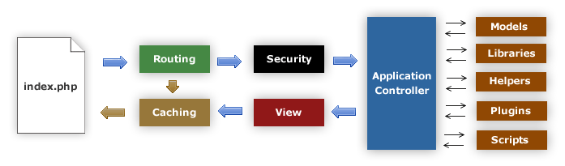

######################
Application Flow Chart
######################

The following graphic illustrates how data flows throughout the system:

|CodeIgniter application flow|

#. The index.php serves as the front controller, initializing the base
   resources needed to run CodeIgniter.
#. The Router examines the HTTP request to determine what should be done
   with it.
#. If a cache file exists, it is sent directly to the browser, bypassing
   the normal system execution.
#. Security. Before the application controller is loaded, the HTTP
   request and any user submitted data is filtered for security.
#. The Controller loads the model, core libraries, helpers, and any
   other resources needed to process the specific request.
#. The finalized View is rendered then sent to the web browser to be
   seen. If caching is enabled, the view is cached first so that on
   subsequent requests it can be served.

